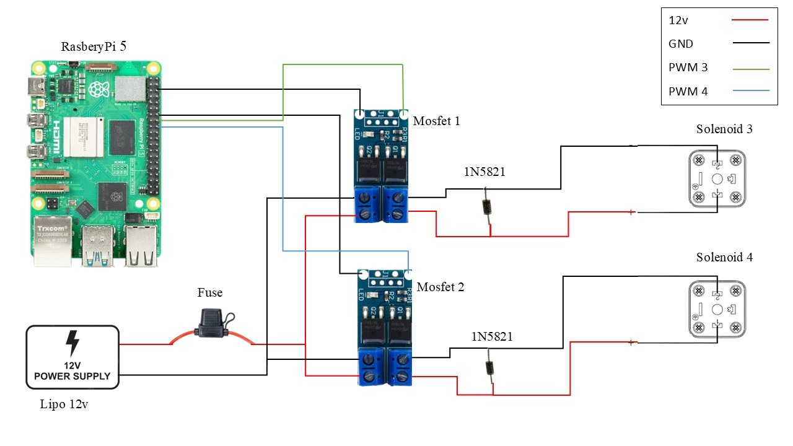

# HopfenROS_RPTU

This repository is for all the tasks performed in the Lab by students and committed to it.

## Solenoid Switching System

The [solenoid_switching.py](solenoid_switching.py) script drives two solenoids
(wired to GPIO 23 and GPIO 24 on a Raspberry Pi) so they alternate ON and OFF
like a two-stroke pump or oscillating valve.

**What it does:**

- Starts with both solenoids OFF in a known safe state.
- Energizes Solenoid 3 for a short pulse, then switches it OFF.
- Waits a mandatory `DEAD_TIME` gap and verifies (by reading the pin back)
  that Solenoid 3 is actually OFF — never just trusting the command.
- Energizes Solenoid 4 for a short pulse, then switches it OFF.
- Repeats this alternation continuously until stopped with `Ctrl+C`.
- If the safety check ever detects both solenoids could be energized at
  once, it aborts immediately and forces both pins LOW.
- On exit (safety fault, manual stop, or crash), it always cleans up the
  GPIO and leaves both solenoids OFF.

The fastest reliable cycle period found through testing is **6.5 s**
(~0.154 Hz). Going faster risked incomplete actuation.
